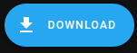

## HACS - Add custom Frontend components
By adding HACS (Home Assistant Custom Components) you can add new functionalities.  
NOTE: After adding a custom component, Home Assistant must be restarted for the new functionality to be loaded.

### Table of contents
1. [Install suggested components](#install-suggested-components-used-to-add-functionality-to-the-frontend)
2. [Restart Home Assistant](#restart-home-assistant)
3. [Examples of other use full custom components](#examples-of-other-custom-integrations-using-hacs)

### Install suggested components used to add functionality to the Frontend
Later these two components will be used to create buttons, sliders and incrementally increasing/decreasing buttons. 
To achieve this functionality, two components are required:
- button-card, Lovelace button-card for _Home Assistant_
- Number Box, Allow for replacement of input_number sliders with plus and minus buttons

Add these components to _Home Assistant_ by in the main menu on the left side select _HACS_ and then select Frontend:
  

Search for "button" and select each component and press "Download" respectively.

Download each component by pressing this button located in the lower right corner.  

### Restart Home Assistant
Custom components require a restart of Home Assistant to be loaded, hence restart Home Assistant!

### Examples of other custom integrations using HACS
- An integration provides means to
gather data from external sources such as energy prices or a car manufacturer to show the current status of you vehicle. 
   
  [Nordpool HACS Integration](https://github.com/custom-components/nordpool)  

- A Frontend component expands the functionality of the interface by providing for instance new button types, sliders or more advanced charts.
  An example here is the apexchart-card:  
  

