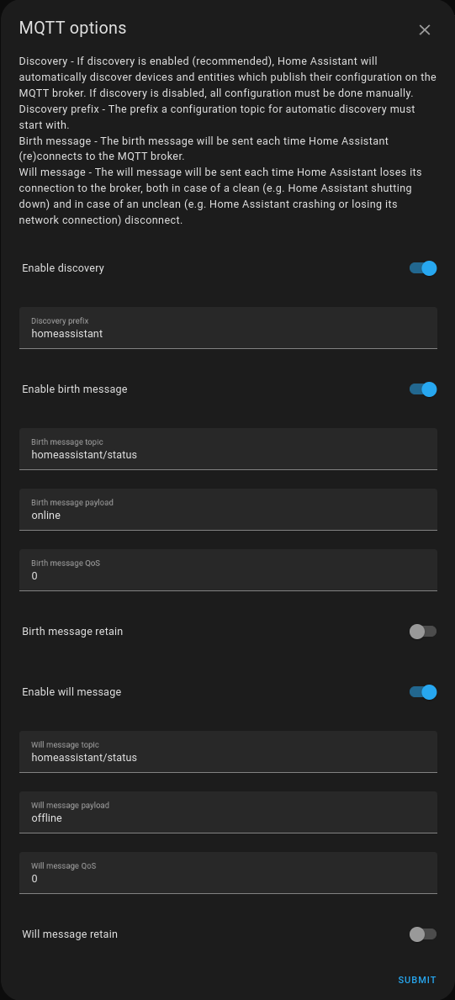

## Configure Home Assistant - _MQTT Integration_

To be able to monitor and control _nibepi_ an integration is required which can both subscribe from and publish messages
to the mqtt broker. The requested registers must be selected in _nibepi_ to be published to the _mqtt broker_ and be 
be available for _Home Assistant_ to discover.

### Add _MQTT_ integration
1. From the _Settings_ menu, selection _Devices & Services_:

  

2. Press _+ Add integration_:  

  

3. Search for the integration "MQTT" and press _MQTT_ in the results

  

4. Select "MQTT" again in the following menu:  

   

5. Configure the _MQTT_ integration - Page 1:  
Use the same settings as used during [configuration of _nibepi_](nibepi-settings-mqtt.md).  

   
- Add the address to the same broker as used for the _nibepi_
- Username & Password, in this example an additional user has been added in the mqtt broker for increased security. However, you can use the same as in the configuration of _nibepi_
- Press "_Next_"

6. Configure the _MQTT_ integration - Page 2:  
Use the same settings as used during [configuration of _nibepi_](nibepi-settings-mqtt.md).  

  
- Use the "Discovery prefix": _homeassistant_
  This will allow for _Home Assisstant_ to discover all devices in sub-topics of this prefix.
  I.e. homeassistant/nibe which is used in the [configuration of _nibepi_](nibepi-settings-mqtt.md).  
- Press "_Submit_"

7. Select "_Entities_" and filter for "sensor.nibe_" to list the newly discovered _Entities_  
NOTE: Only devices which has been selected in the _nibepi_ "Datahantering/Registerhantering" will be available.

which is a selection of the registers which is required for the remainder of this tutorial.

