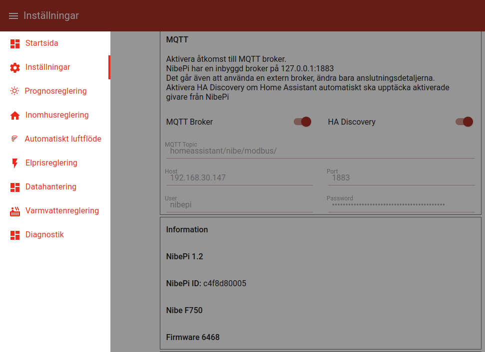
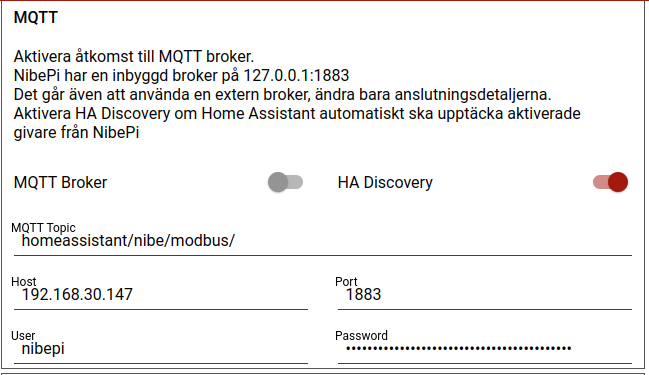

# Integrate nibepi to Home Assistant
Tutorial on how to connect nibepi to Home Assistant to allow for monitoring and controlling
the Nibe heat pump from Home Assistant. It allows for monitoring of current values such as:
- utilization of electrical heater
- Warm water temperature
- Outdoor and indoor temperature sensors
- Condenser and evaporator temperatures
- Fan speed
- Pump frequency
- and many more things....

nibepi is a project found on [https://github.com/anerdins/nibepi](https://github.com/anerdins/nibepi) 
with a closed community on Facebook [https://www.facebook.com/groups/nibepi/](https://www.facebook.com/groups/nibepi/)
where you can as request to join. The community is a great place for questions and share your experiences primarily
with nibepi. The base of many examples in this tutorial has been found in posts and comments in the Facebook group.

## Table of contents
1. [Prerequisites](#prerequisites)
2. [Configuration](#configuration)
   1. [nibepi - mqtt settings](nibepi-settings-mqtt.md)

## Prerequisites
This tutorial assumes the following:
- A working nibepi connected to your heat pump and reachable on your local network
- A working [mqtt server/broker](https://mqtt.org/). Either in Home Assistant as [add-on (instructions link)](https://github.com/home-assistant/addons/blob/174f8e66d0eaa26f01f528beacbde0bd111b711c/mosquitto/DOCS.md#how-to-use) or stand alone.
- A working [Home Assistant](https://www.home-assistant.io/) system
- The [HACS-plugin](https://hacs.xyz/) installed in Home Assistant.

## Configuration
- Configure  _nibepi_: [nibe pi settings](nibepi-settings-mqtt.md)
- Configure _Home Assistant_ - mqtt 
## nibepi - mqtt settings
Navigate to the webinterface of your nibepi (http://nibepi:1880/ui). Replace _nibepi_ 
with the name or the ip adress on your local network.

In the top left menu _Startsida_ select _Inställningar_:

To be able to change the values the MQTT Broker switch must be turned off. 

Add the following information:
- MQTT-topic, in this example _homeassistant/nibe/modbus_ will be used as topic
- Host, address to your mqtt server/broker
- Port, the port that your mqtt broker listens on
- User, username to logg in to the mqtt broker
- Password, the corresponding password for the user to log in to the mqtt broker

Ensure that the HA Disovery switch is turned on to allow for automatic discovery of sensors in Home Assistant.
Turn on the switch for the MQTT Broker.

WARNING: If a connection to the mqtt broker can not be achieved, _nibepi_ will stop trying to connect to the broker. This 
can happen when restarting from a power outage and may be resolved with a restart of the _nibepi_.

