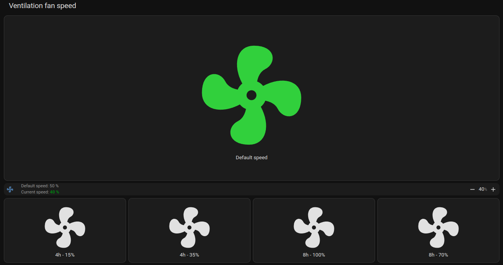
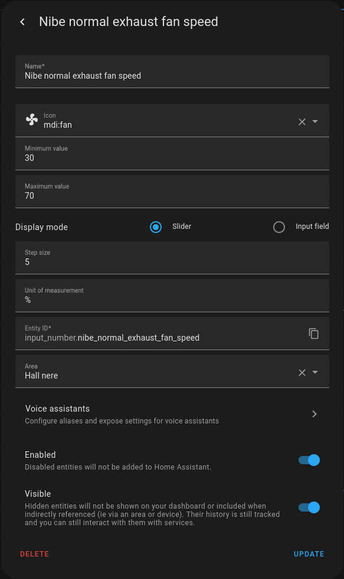

## Home Assistant - Fan control panel

This panel allow for simplified control of the exhaust fan speed of the heat pump using these buttons. It allows for
control of the predefined fan modes 1-4 as well as the default fan speed.  

  

The following registers must be exposed by _nibepi_ [Register, Sensor name, Description:
- 43086, nibe_int_el_add_power, Current power of the electrical heater
- 40050, nibe_exhaust_air_flow_bs1, Current exhaust air flow

nibe_fan_return_time_1
nibe_exhaust_fan_speed_1

### Prerequisites
1. [Home Assistant - Add HACS custom Frontend component numberbox-card](../../HomeAssistant-HACS-Add_Components.md)

### Step-by-step guide
1. Create a _Helper_ to set and get current default fan speed from _nibepi_
   1. Select "Settings" in the menu on the left side
   2. Select "Device & Services"
   3. Select "Helpers"  
        
   WARNING: Setting a very low fan speed will reduce the efficiency of the heat pump.

2. In the _Home Assistant_ overview select:
   - In the top right corner, press 
   - In the menu select "Edit dashboard"
   - Select a View where the new card will be added. 
     1. Add a new Card and select "Vertical stack" card as type
     2. In the card select "Show code editor" in the bottom.
     3. Replace the code with the following code from [nibe_Fan_control.yaml](nibe_fan_control.yaml) or copy from below:

        NOTE: For the _Entity_: "input_number.nibe_normal_exhaust_fan_speed" replace the secondary info
         "Default speed: 50" with the speed optimal for your house.

```yaml
type: vertical-stack
title: Ventilation fan speed
cards:
  - type: horizontal-stack
    cards:
      - type: custom:button-card
        entity: sensor.nibe_fan_mode
        aspect_ratio: 3/1
        tap_action:
          action: call-service
          service: mqtt.publish
          service_data:
            topic: homeassistant/nibe/modbus/47260/set
            payload: '0'
        hold_action:
          action: none
        name: Default speed
        show_name: true
        icon: mdi:fan
        state:
          - value: Normal
            color: limegreen
  - type: custom:numberbox-card
    entity: input_number.nibe_normal_exhaust_fan_speed
    name: null
    min: 30
    max: 70
    step: 5
    secondary_info: >
      Default speed: 50 %% <br> Current speed:<b  style="color:green">
      %sensor.nibe_exhaust_fan_speed_normal:state %% </b>
  - type: horizontal-stack
    cards:
      - type: custom:button-card
        entity: sensor.nibe_fan_mode
        tap_action:
          action: call-service
          service: mqtt.publish
          service_data:
            topic: homeassistant/nibe/modbus/47260/set
            payload: '1'
        hold_action:
          action: none
        name: |
          [[[
            return states['sensor.nibe_fan_return_time_1'].state + 'h - ' + states['sensor.nibe_exhaust_fan_speed_1'].state + '%';
          ]]]
        show_name: true
        icon: mdi:fan
        state:
          - value: Hastighet 1
            color: limegreen
      - type: custom:button-card
        entity: sensor.nibe_fan_mode
        tap_action:
          action: call-service
          service: mqtt.publish
          service_data:
            topic: homeassistant/nibe/modbus/47260/set
            payload: '2'
        hold_action:
          action: none
        name: |
          [[[
            return states['sensor.nibe_fan_return_time_2'].state + 'h - ' + states['sensor.nibe_exhaust_fan_speed_2'].state + '%';
          ]]]
        show_name: true
        icon: mdi:fan
        state:
          - value: Hastighet 2
            color: limegreen
      - type: custom:button-card
        entity: sensor.nibe_fan_mode
        tap_action:
          action: call-service
          service: mqtt.publish
          service_data:
            topic: homeassistant/nibe/modbus/47260/set
            payload: '3'
        hold_action:
          action: none
        name: |
          [[[
            return states['sensor.nibe_fan_return_time_3'].state + 'h - ' + states['sensor.nibe_exhaust_fan_speed_3'].state + '%';
          ]]]
        show_name: true
        icon: mdi:fan
        state:
          - value: Hastighet 3
            color: limegreen
      - type: custom:button-card
        entity: sensor.nibe_fan_mode
        tap_action:
          action: call-service
          service: mqtt.publish
          service_data:
            topic: homeassistant/nibe/modbus/47260/set
            payload: '4'
        hold_action:
          action: none
        name: |
          [[[
            return states['sensor.nibe_fan_return_time_4'].state + 'h - ' + states['sensor.nibe_exhaust_fan_speed_4'].state + '%';
          ]]]
        show_name: true
        icon: mdi:fan
        state:
          - value: Hastighet 4
            color: limegreen
```

The following automations are required for the + and - button to have an effect when setting a new target fan speed.

3. Automation 1 - Ventilation - Get normal exhaust fan speed
This automation keeps the helper updated using the _nibepi_ as source. This allows for changes both through
_Home Assistant_ and directly on the Nibe heat pump display. Perform the following steps:
 - Create a new automation
 - In the top right corner select 
 - Select "Edit in YAML-mode"
 - Past the following content
```yaml
alias: Ventilation - Get normal exhaust fan speed
description: Get current normal exhaust fan speed from the Nibe heatpump
trigger:
  - platform: state
    entity_id:
      - sensor.nibe_exhaust_fan_speed_normal
condition: []
action:
  - service: input_number.set_value
    data_template:
      entity_id: input_number.nibe_normal_exhaust_fan_speed
      value: "{{ states('sensor.nibe_exhaust_fan_speed_normal') }}"
mode: single
```
4. Automation 2 - Ventilation - Set normal exhaust fan speed
This automation keeps the helper updated using the _nibepi_ as source. This allows for changes both through
_Home Assistant_ and directly on the Nibe heat pump display. Perform the following steps:
 - Create a new automation
 - In the top right corner select 
 - Select "Edit in YAML-mode"
 - Past the following content
```yaml
alias: Ventilation - Set normal exhaust fan speed
description: Set normal exhaust fan speed for Nibe heatpump
trigger:
  - platform: state
    entity_id:
      - input_number.nibe_normal_exhaust_fan_speed
condition: []
action:
  - service: mqtt.publish
    data:
      topic: homeassistant/nibe/modbus/47265/set
      payload_template: "{{states('input_number.nibe_normal_exhaust_fan_speed') | string}}"
mode: single
```