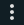

## Home Assistant - Status image with temperature control

Example for visualizing the current state of your heatpump, this example is from a Nibe 750F but is valid for most
heat pumps functions.  
  
The image displays the following information [Register, Sensor name, Description:
- 43086, nibe_int_el_add_power, Current power of the electrical heater
- 40050, nibe_exhaust_air_flow_bs1, Current exhaust air flow
- 40004, nibe_bt1_outdoor_temperature, Out door temperature from sensor BT1
- 40005, nibe_bt2_supply_temp_s1, Temperature of water to radiators and floor heating
- 40012, nibe_eb100_ep14_bt3_return_temp, Temperature of water from radiators and floor heating
- 40014, nibe_bt6_hw_load, Hot water temperature at the bottom of the tank
- 40013, nibe_bt7_hw_top, Hot water temperature in the top of the tank
- 40017, nibe_eb100_ep14_bt12_condensor_out, Temperature of gas exiting the condensor and prior to the evaporator
- 40018, nibe_eb100_ep14_bt14_hot_gas_temp, Temperature of hot gas exiting the compressor
- 40020, nibe_eb100_bt16_evaporator_temp, Temperature of gas exiting the evaporator
- 40022, nibe_eb100_ep14_bt17_suction, Temperature of medium prior compressor 
- 40025, nibe_bt20_exhaust_air_temp_1, Temperature of ventilated air
- 40026, nibe_bt21_vented_air_temp_1, Temperature of air exhausted to the outside from the heat pump
- Current indor target temperature using the Helper input_number.indoor_set_temperature with HACS - numberbox-card

### Prerequisites
1. [Home Assistant - Add HACS custom Frontend component numberbox-card](HomeAssistant-HACS-Add_Components.md)

### Step-by-step guide
1. Download the schematic image [nibe_schematics.png](nibe_schematics.png)

2. Upload the image [Nibe display](nibe_schematics.png) to _Home Assistant_.  
   The image must be placed in the folder /www/ to be reachable to the web interface. In this example the file will be
   located at /www/images/nibe_schematics.png.  This corresponds to /local/images/nibe_schematics.png in the configuration.
  
3. In the _Home Assistant_ overview select:
   - In the top right corner, press 
   - In the menu select "Edit dashboard"
   - Press the "+" sign in the top row to add a new View.  
     1. Configure the new View
        
     2. Add a new Card and select "Picture elements" card as type
     3. In the card select "Show code editor" in the bottom.
     4. Replace the code with the following code from [nibe_display.yaml](nibe_display.yaml) or copy from below:
```yaml
elements:
  - type: state-label
    entity: sensor.nibe_int_el_add_power
    prefix: 'Heater: '
    style:
      top: 50%
      left: 35%
  - type: state-label
    entity: sensor.nibe_exhaust_air_flow_bs1_as_int
    prefix: 'BS1: '
    style:
      top: 75%
      left: 51%
  - type: state-label
    entity: sensor.nibe_bt1_outdoor_temperature
    prefix: 'BT1: '
    style:
      top: 88%
      left: 10%
  - type: state-label
    entity: sensor.nibe_bt2_supply_temp_s1
    prefix: 'BT2: '
    style:
      top: 6%
      left: 40%
  - type: state-label
    entity: sensor.nibe_eb100_ep14_bt3_return_temp
    prefix: 'BT3: '
    style:
      top: 10%
      left: 10%
  - type: state-label
    entity: sensor.nibe_bt6_hw_load
    prefix: 'BT6: '
    style:
      top: 30%
      left: 30%
  - type: state-label
    entity: sensor.nibe_bt7_hw_top
    prefix: 'BT7: '
    style:
      top: 23%
      left: 30%
  - type: state-label
    entity: sensor.nibe_eb100_ep14_bt12_condensor_out
    prefix: 'BT12: '
    style:
      top: 44%
      left: 10%
  - type: state-label
    entity: sensor.nibe_eb100_ep14_bt14_hot_gas_temp
    prefix: 'BT14: '
    style:
      top: 44%
      left: 60%
  - type: state-label
    entity: sensor.nibe_eb100_bt16_evaporator_temp
    prefix: 'BT16: '
    style:
      top: 60%
      left: 10%
  - type: state-label
    entity: sensor.nibe_eb100_ep14_bt17_suction
    prefix: 'BT17: '
    style:
      top: 60%
      left: 60%
  - type: state-label
    entity: sensor.nibe_bt20_exhaust_air_temp_1
    prefix: 'BT20: '
    style:
      top: 91%
      left: 36%
  - type: state-label
    entity: sensor.nibe_bt21_vented_air_temp_1
    prefix: 'BT21: '
    style:
      top: 68%
      left: 12%
  - type: custom:numberbox-card
    entity: input_number.indoor_set_temperature
    name: false
    icon: false
    min: 16
    max: 25
    step: 0.5
    card_mod:
      style: |
        ha-card {
          background: grey;
        }
    style:
      top: 91%
      left: 22%
image: /local/images/nibe_schematics.png
type: picture-elements
```
4. Press "Save" and the card should appear.

The following automations are required for the + and - button to have an effect when setting a new target temperature
for the indoor temperature. They are the same as used for the example [Status image with temperature control](../status_image_with_temperature_control/status_image_with_temperature_control.md) and
should not be duplicated. If they have not been defined previously, perform step 4 & 5 to add them.

5. Automation 1 - Get indoor target temperature  
This automation keeps the helper updated using the _nibepi_ as source. This allows for changes both through
_Home Assistant_ and directly on the Nibe heat pump display. Perform the following steps:
 - Create a new automation
 - In the top right corner select 
 - Select "Edit in YAML-mode"
 - Past the following content
```yaml
alias: Temperature - Get indoor target temperature
description: Get the temperature from the Nibe heatpump
trigger:
  - platform: state
    entity_id:
      - sensor.nibe_room_sensor_setpoint_s1
condition: []
action:
  - service: input_number.set_value
    data_template:
      entity_id: input_number.indoor_set_temperature
      value: "{{ states('sensor.nibe_room_sensor_setpoint_s1') }}"
mode: single
```
6. Automation 2 - Set indoor target temperature  
This automation keeps the helper updated using the _nibepi_ as source. This allows for changes both through
_Home Assistant_ and directly on the Nibe heat pump display. Perform the following steps:
 - Create a new automation
 - In the top right corner select 
 - Select "Edit in YAML-mode"
 - Past the following content
```yaml
alias: Temperature - Set target temperature
description: Set indor target temperature
trigger:
  - platform: state
    entity_id:
      - input_number.indoor_set_temperature
condition: []
action:
  - service: mqtt.publish
    data:
      topic: homeassistant/nibe/modbus/47398/set
      payload_template: "{{states('input_number.indoor_set_temperature') | string}}"
mode: single
```