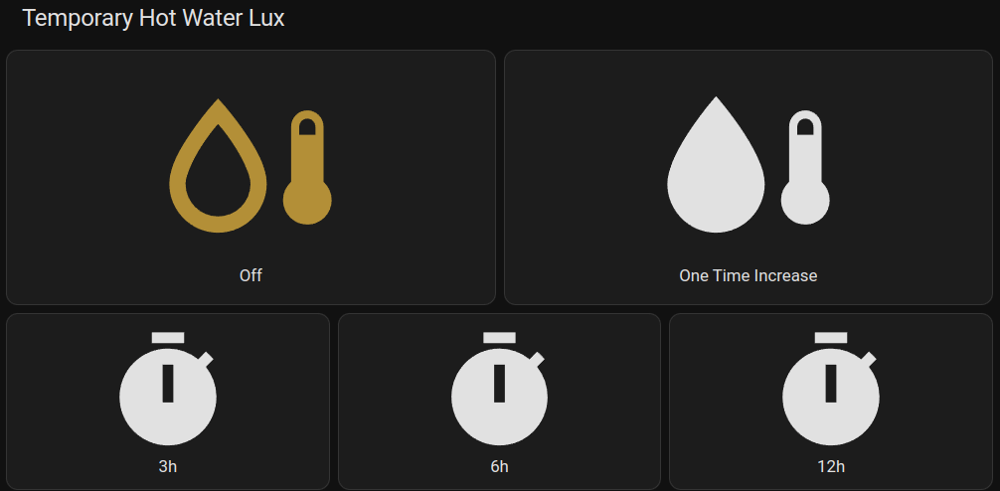

## Home Assistant - Fan control panel

This panel allow for simplified control of current hot water mode using these buttons. It allows for
control of the default predefined hot water modes.  

  

The following registers must be exposed by _nibepi_ [Register, Sensor name, Description]:

- 47041, nibe_hot_water_comfort_mode, Current hot water comfort mode. States:
  - 0 = Economy mode - Reduces hot water temperature starting point to reduce hot water production
  - 1 = Normal mode - Normal hot water production
  - 2 = Luxury mode - Increase hot water temperature starting point to prioritize hot water production
- 48132, nibe_temporary_lux, Current temporary hot water lux mode. States:
  - 0 = Off
  - 1 = Temporary lux for 3 hours
  - 2 = Temporary lux for 6 hours
  - 3 = Temporary lux for 12 hours
  - 4 = One time increase


### Prerequisites
1. [Home Assistant - Add HACS custom Frontend component button-card](../../HomeAssistant-HACS-Add_Components.md)

### Step-by-step guide
1. Add Hot water card
   - Go to the _Home Assistant_ overview
   - In the top right corner, press 
   - In the menu select "Edit dashboard"
   - Select a View where the new card will be added. 
     1. Add a new Card and select "Vertical stack" card as type
     2. In the card select "Show code editor" in the bottom.
     3. Replace the code with the following code from [nibe_Hot_water_control.yaml](nibe_Hot_water_control.yaml) or copy from below:


```yaml
type: vertical-stack
cards:
  - type: horizontal-stack
    title: Hot water mode
    cards:
      - type: custom:button-card
        entity: sensor.nibe_hot_water_comfort_mode
        tap_action:
          action: call-service
          service: mqtt.publish
          service_data:
            topic: homeassistant/nibe/modbus/47041/set
            payload: '0'
        hold_action:
          action: none
        name: Economy
        show_name: true
        icon: mdi:thermometer-low
        state:
          - value: '0'
            color: limegreen
      - type: custom:button-card
        entity: sensor.nibe_hot_water_comfort_mode
        tap_action:
          action: call-service
          service: mqtt.publish
          service_data:
            topic: homeassistant/nibe/modbus/47041/set
            payload: '1'
        hold_action:
          action: none
        name: Normal
        show_name: true
        icon: mdi:thermometer
        state:
          - value: '1'
            color: orange
      - type: custom:button-card
        entity: sensor.nibe_hot_water_comfort_mode
        tap_action:
          action: call-service
          service: mqtt.publish
          service_data:
            topic: homeassistant/nibe/modbus/47041/set
            payload: '2'
        hold_action:
          action: none
        name: Luxury
        show_name: true
        icon: mdi:thermometer-high
        state:
          - value: '2'
            color: orangered
  - type: horizontal-stack
    title: Temporary Hot Water Lux
    cards:
      - type: custom:button-card
        entity: sensor.nibe_temporary_lux
        tap_action:
          action: call-service
          service: mqtt.publish
          service_data:
            topic: homeassistant/nibe/modbus/48132/set
            payload: '0'
        hold_action:
          action: none
        name: 'Off'
        show_name: true
        icon: mdi:water-thermometer-outline
        state:
          - value: '0'
            color: '#b58e31'
      - type: custom:button-card
        entity: sensor.nibe_temporary_lux
        tap_action:
          action: call-service
          service: mqtt.publish
          service_data:
            topic: homeassistant/nibe/modbus/48132/set
            payload: '4'
        hold_action:
          action: none
        name: One Time Increase
        show_name: true
        icon: mdi:water-thermometer
        state:
          - value: '4'
            color: '#b58e31'
  - type: horizontal-stack
    cards:
      - type: custom:button-card
        entity: sensor.nibe_temporary_lux
        tap_action:
          action: call-service
          service: mqtt.publish
          service_data:
            topic: homeassistant/nibe/modbus/48132/set
            payload: '1'
        hold_action:
          action: none
        name: 3h
        show_name: true
        icon: mdi:timer
        state:
          - value: '1'
            color: '#b58e31'
      - type: custom:button-card
        entity: sensor.nibe_temporary_lux
        tap_action:
          action: call-service
          service: mqtt.publish
          service_data:
            topic: homeassistant/nibe/modbus/48132/set
            payload: '2'
        hold_action:
          action: none
        name: 6h
        show_name: true
        icon: mdi:timer
        state:
          - value: '2'
            color: '#b58e31'
      - type: custom:button-card
        entity: sensor.nibe_temporary_lux
        tap_action:
          action: call-service
          service: mqtt.publish
          service_data:
            topic: homeassistant/nibe/modbus/48132/set
            payload: '3'
        hold_action:
          action: none
        name: 12h
        show_name: true
        icon: mdi:timer
        state:
          - value: '3'
            color: '#b58e31'
```