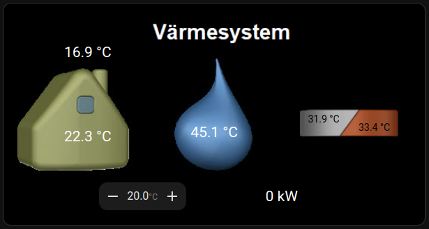
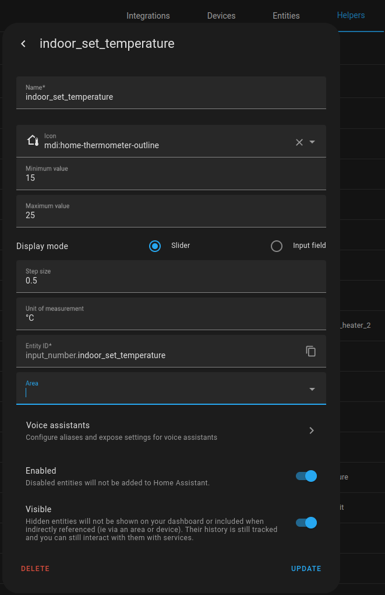
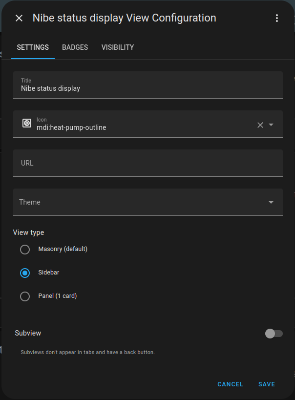
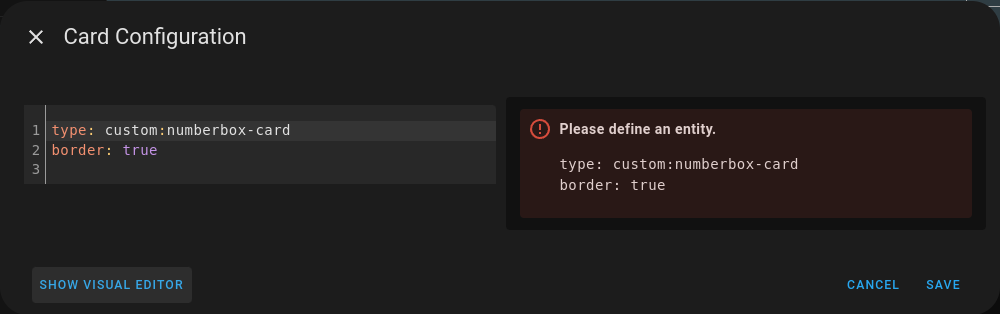

## Home Assistant - Status image with temperature control

Example for creating a status image similar to Nibe heat pump display with temperature control inspired by Andreas Nygren in the [nibepi-group on Facebook](https://www.facebook.com/groups/nibepi/posts/1306674769894056/):  
  
The image displays the following information:
- Outside temperature
- Indoor temperature
- Hot water temperature (Top)
- Supply water temperature
- Return water temperature
- Requested indoor temperature
- Current power of the electrical heater


1. Create a helper to set and get current temperature from _nibepi_
   1. Select "Settings" in the menue on the left sied
   2. Select "Device & Services"
   3. Select "Helpers"
   
2. Upload the image [Nibe display](nibe_display.png) to _Home Assistant_.  
   The image must be placed in the folder /www/ to be reachable to the web interface. In this example the file will be
   located at /www/images/nibe_display.png.  
  
3. In the _Home Assistant_ overview select:
   - In the top right corner, press 
   - In the menu select "Edit dashboard"
   - Press the "+" sign in the top row to add a new View.  
     
   1. Configure the new View
   
   2. Add a new Card and select "Cutom: Numberbox card" as type
4. In the card select "Show code editor" in the bottom.
   
5. Replace the code with the following code from [nibe_display.yaml](nibe_display.yaml)
```yaml
elements:
  - type: state-label
    entity: sensor.nibe_bt50_room_temp_s1
    style:
      top: 60%
      left: 20%
      font-size: 150%
      color: white
  - type: state-label
    entity: sensor.nibe_bt1_outdoor_temperature
    style:
      top: 22%
      left: 20%
      font-size: 150%
      color: white
  - type: state-label
    entity: sensor.nibe_bt7_hw_top
    style:
      top: 58%
      left: 50%
      font-size: 150%
      color: white
  - type: state-label
    entity: sensor.nibe_eb100_ep14_bt3_return_temp
    unit: ''
    style:
      top: 52%
      left: 76%
      font-size: 100%
      color: black
  - type: state-label
    entity: sensor.nibe_bt2_supply_temp_s1
    unit: ''
    style:
      top: 56%
      left: 88%
      font-size: 100%
      color: black
  - type: custom:numberbox-card
    entity: input_number.indoor_set_temperature
    name: false
    icon: false
    min: 16
    max: 25
    step: 0.5
    card_mod:
      style: |
        ha-card {
          background: white;
        }
    style:
      top: 87%
      left: 33%
  - type: state-label
    entity: sensor.nibe_int_el_add_power
    style:
      top: 87%
      left: 66%
      font-size: 150%
      color: white
image: /local/images/nibe_display.png
type: picture-elements

```
6. Press "Save" and the card should appear. However, the buttons have no effect yet.
7. Automation 1 - Get indoor target temperature  
This automation keeps the helper updated using the _nibepi_ as source. This allows for changes both through
_Home Assistant_ and directly on the Nibe heat pump display. Perform the following steps:
 - Create a new automation
 - In the top right corner select 
 - Select "Edit in YAML-mode"
 - Past the following content
```yaml
alias: Temperature - Get indoor target temperature
description: Get the temperature from the Nibe heatpump
trigger:
  - platform: state
    entity_id:
      - sensor.nibe_room_sensor_setpoint_s1
condition: []
action:
  - service: input_number.set_value
    data_template:
      entity_id: input_number.indoor_set_temperature
      value: "{{ states('sensor.nibe_room_sensor_setpoint_s1') }}"
mode: single
```
8. Automation 2 - Set indoor target temperature  
This automation keeps the helper updated using the _nibepi_ as source. This allows for changes both through
_Home Assistant_ and directly on the Nibe heat pump display. Perform the following steps:
 - Create a new automation
 - In the top right corner select 
 - Select "Edit in YAML-mode"
 - Past the following content
```yaml
alias: Temperature - Set target temperature
description: Set indor target temperature
trigger:
  - platform: state
    entity_id:
      - input_number.indoor_set_temperature
condition: []
action:
  - service: mqtt.publish
    data:
      topic: homeassistant/nibe/modbus/47398/set
      payload_template: "{{states('input_number.indoor_set_temperature') | string}}"
mode: single
```