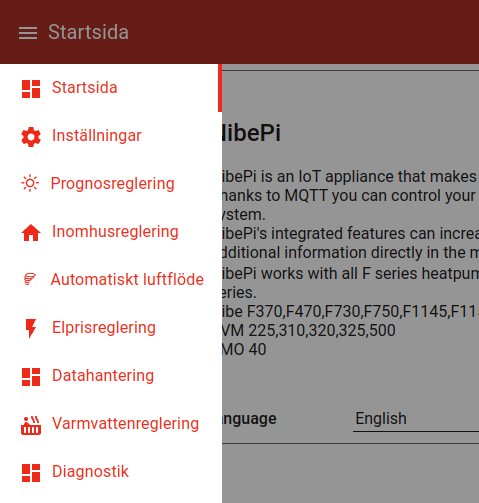
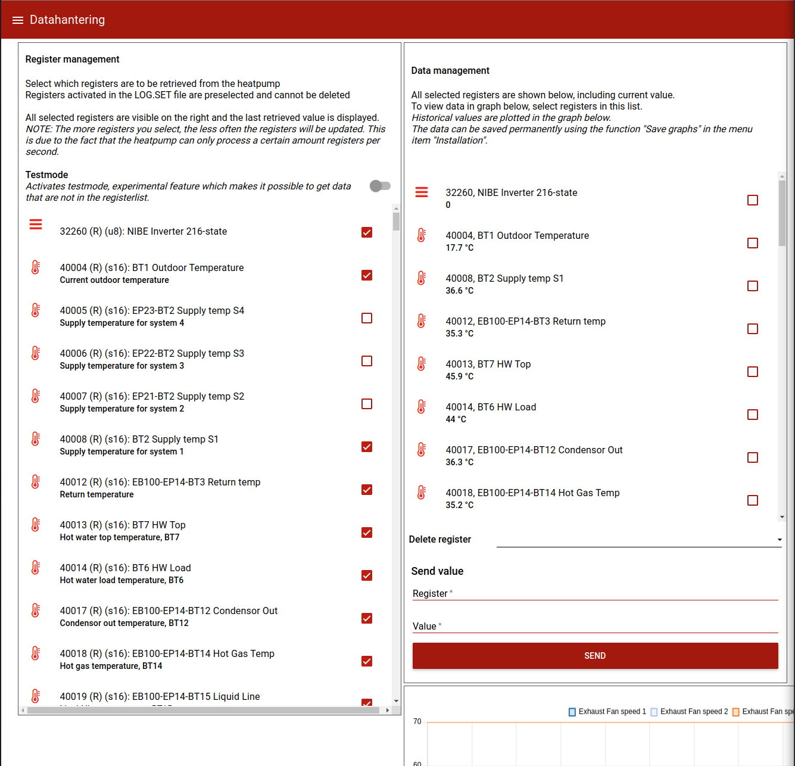

## nibepi - Registers to publish to mqtt

Since _nibepi_ is typically running on a _RaspberryPI Zero_ the compute capacity is severly limited. Hence, 
only a selection of all available registers is recommended to be exported to Home Assistant. Further, in most 
installations many of the registers are not in use as well.

To publish a register to the _mqtt broker_ from _nibepi_ navigate to the webinterface of your nibepi (http://nibepi:1880/ui). Replace _nibepi_ 
with the name or the ip adress on your local network.

In the top left menu _Startsida_ select _Datahantering_ (Data management):  

  
This wil expose a long list of all registers available for export from _nibepi_ as shown:

  
In the section "_Register management_" select the registers which you would like to publish to mqtt by checking the box 
for each entry. For most of the registers and indication regarding Read and Write permissions. A register where only
reading is allow is denoted with (R) and a register which allow for both read and write id denoted with (R/W). 
Typically, a registry defining a set point has write permissions while a registry from a temperature sensor is read only.

Here is a subset of all registers which may be usefully for export to be monitored in _Home Assistant_ with some descriptions:
- 32260, NIBE Inverter 216-state
- 40004, BT1 Outdoor Temperature, This sensor reads the outside temperature when connected.
- 40008, BT2 Supply temp S1
- 40012, EB100-EP14-BT3 Return temp
- 40013, BT7 HW Top, Hot water temperature i the top of the heater
- 40014, BT6 HW Load, Hot water temperature i the bottom of the heater where cold water is added when needed
- 40017, EB100-EP14-BT12 Condensor Out
- 40018, EB100-EP14-BT14 Hot Gas Temp
- 40019, EB100-EP14-BT15 Liquid Line
- 40020, EB100-BT16 Evaporator temp
- 40022, EB100-EP14-BT17 Suction
- 40025, BT20 Exhaust air temp. 1, Temperature of indor air exhausted from the heat pump to outside
- 40026, BT21 Vented air temp. 1, Temperature of indoor air entering the heat pump
- 40033, BT50 Room Temp S1, Reading from the room sensor in the house when available
- 40047, EB100-BT61 Supply Radiator Temp
- 40048, EB100-BT62 Return Radiator Temp
- 40050, EB100-BS1 Air flow, Current air flow of indoor air entering the heatpump
- 43005, Degree Minutes (16 bit), How many minutes the heatpump is lagging behind to reach the desired temperature.
- 43009, Calc. Supply S1, Calculated temperature in floor heating / radiators required to reach the desired temperature. 
- 43066, Defrosting time
- 43084, Int. el.add. Power, How much electrical power that is used as addition to the heat pump for water and climate.
- 43136, Compressor Frequency, Actual
- 43141, compr. in power
- 45001, Alarm, Alarms generated from the heat pump
- 47007, Heat Curve S1
- 47011, Heat Offset S1
- 47041, Hot water comfort mode, Hot water mode can be altered between Economy, Normal and Luxury mode.
- 47260, Fan Mode
- 47261, Exhaust Fan speed 4, Set exhaust speed \[0-100%\] for Speed number 4
- 47262, Exhaust Fan speed 3, Set exhaust speed \[0-100%\] for Speed number 3
- 47263, Exhaust Fan speed 2, Set exhaust speed \[0-100%\] for Speed number 2
- 47264, Exhaust Fan speed 1, Set exhaust speed \[0-100%\] for Speed number 1
- 47265, Exhaust Fan speed normal, Set exhaust speed \[0-100%\] for normal mode
- 47271, Fan return time 4, Time in hours until the exhaust speed returns to normal speed for Speed numer 4
- 47272, Fan return time 3, Time in hours until the exhaust speed returns to normal speed for Speed numer 3
- 47273, Fan return time 2, Time in hours until the exhaust speed returns to normal speed for Speed numer 2
- 47274, Fan return time 1, Time in hours until the exhaust speed returns to normal speed for Speed numer 1
- 47398, Room sensor setpoint S1, Requested indor room temperature
- 47402, Room sensor factor S1, Weight factor to use between outdoor and indoor temperature sensors.
- 48043, Holiday - Activated, Activate holiday mode to reduce temperatures while away \[0=Off, 1=On\]
- 48132, Temporary Lux, If temporary Lux for hot waters should be activated and in which mode.

Many more registers can be exported and monitored in Home Assistant.