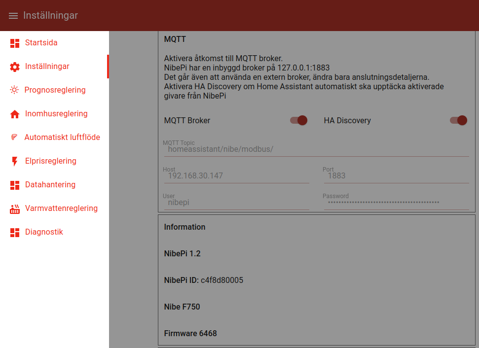

## nibepi - mqtt settings
Navigate to the webinterface of your nibepi (http://nibepi:1880/ui). Replace _nibepi_ 
with the name or the ip adress on your local network.

In the top left menu _Startsida_ select _Inställningar_:

To be able to change the values the MQTT Broker switch must be turned off. 

Add the following information:
- MQTT-topic, in this example _homeassistant/nibe/modbus_ will be used as topic
- Host, address to your mqtt server/broker
- Port, the port that your mqtt broker listens on
- User, username to logg in to the mqtt broker
- Password, the corresponding password for the user to log in to the mqtt broker

Ensure that the HA Discovery switch is turned on to allow for automatic discovery of sensors in Home Assistant.
Turn on the switch for the MQTT Broker.

WARNING: If a connection to the mqtt broker can not be achieved, _nibepi_ will stop trying to connect to the broker. This 
can happen when restarting from a power outage and may be resolved with a restart of the _nibepi_.
